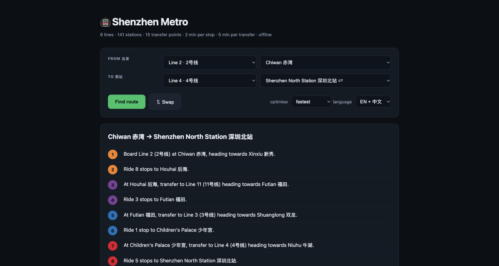
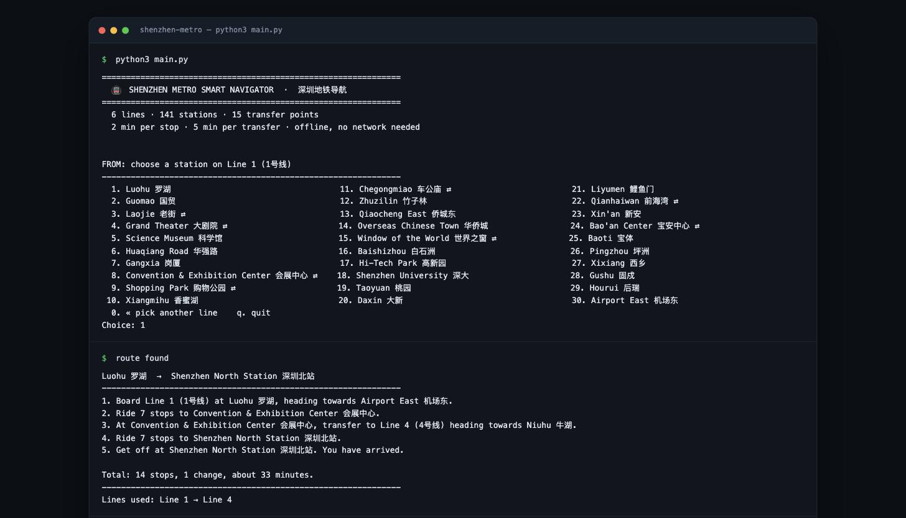
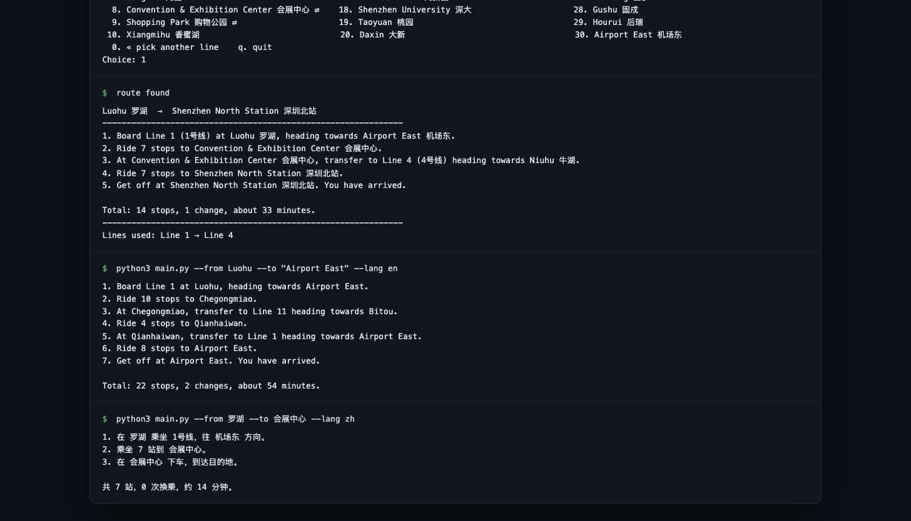

# 🚇 Shenzhen Metro Smart Navigator

An offline route planner for the Shenzhen Metro. Pick a start and an end
station from menus, get plain-language directions with an estimated travel
time. No internet, no API keys, standard library only.

```
Luohu 罗湖  →  Shenzhen North Station 深圳北站
1. Board Line 1 (1号线) at Luohu 罗湖, heading towards Airport East 机场东.
2. Ride 7 stops to Convention & Exhibition Center 会展中心.
3. At Convention & Exhibition Center 会展中心, transfer to Line 4 (4号线) heading towards Niuhu 牛湖.
4. Ride 7 stops to Shenzhen North Station 深圳北站.
5. Get off at Shenzhen North Station 深圳北站. You have arrived.

Total: 14 stops, 1 change, about 33 minutes.
```

---

## Quick start

```bash
cd shenzhen-metro

python3 main.py                                       # interactive CLI
python3 main.py --from Luohu --to "Airport East"      # one-shot lookup
python3 main.py --from 罗湖 --to 会展中心 --lang zh     # Chinese in, Chinese out
python3 main.py --from Chiwan --to Niuhu --json       # structured itinerary
python3 main.py --gui                                 # tkinter interface
python3 web.py                                        # http://127.0.0.1:8731
python3 -m unittest -v                                # 23 unit tests
```

Python 3.8+. No dependencies to install.

**For `--gui` only:** the interpreter needs `tkinter`, which some Homebrew
builds omit. Check with `python3 -c "import tkinter"`; if it fails, use an
interpreter that has it (`/usr/bin/python3`, or `brew install python-tk@3.13`
and run with `python3.13 main.py --gui`). The CLI never needs tkinter.

### Options

| Flag | Meaning |
|---|---|
| `--from` / `--to` | Station by English name, Chinese name, or id. Both or neither. |
| `--lang en\|zh\|both` | Output language. `both` keeps English sentences but prints every name in both scripts. |
| `--optimize time\|stops` | `time` = Dijkstra on real minutes (default). `stops` = BFS counting stops only. |
| `--json` | Print the structured route object instead of prose. |
| `--data PATH` | Use a different map file. |
| `--gui` | Launch the tkinter window. |

---

## Project structure

| File | Responsibility |
|---|---|
| `metro_data.json` | The map: lines, ordered stations, bilingual names, timing model. |
| `navigator.py` | `MetroNetwork` (data), `Router` (Dijkstra + BFS), `InstructionGenerator` (prose). Prints nothing. |
| `ui.py` | CLI: numbered menus, column layout, settings. Computes nothing. |
| `gui.py` | Optional tkinter front end with dependent combo boxes. |
| `web.py` | A local web page on `http.server` — a third front end, still standard library only. |
| `main.py` | Argument parsing and entry point. |
| `test_navigator.py` | 23 unit tests over a toy network and the real map. |

The engine never prints and the interfaces never compute. That is why the CLI
and the GUI can share the exact same `Router` with no adapter in between.

---

## How the routing works

### The graph is line-aware

The obvious model — one node per station, one edge per track — cannot express
a transfer at all. Such a graph does not know which train you are sitting on,
so it happily returns a "short" path that changes lines four times.

So a node is the pair **`(station, line)`**: *being at Futian, on Line 3*.

| Edge | From | To | Cost |
|---|---|---|---|
| ride | `(A, L)` | `(B, L)` where A and B are adjacent on L | 2 min |
| transfer | `(S, L1)` | `(S, L2)` where S is served by both | 5 min |

Boarding is free, because the search starts from *every* `(start, line)` node
at once — the first train you get on is never charged a transfer penalty.

### Dijkstra, not BFS

BFS only finds shortest paths when every edge has the same weight. Here rides
cost 2 minutes and transfers cost 5, so BFS would be plain wrong. The default
mode runs Dijkstra over a lexicographic cost `(minutes, transfers)`; the
second component is a tie-break, so between two equally fast itineraries the
rider gets the one with fewer changes.

BFS is still implemented, as the `--optimize stops` mode: a 0-1 BFS with
ride = 1 and transfer = 0, which answers the different question "what is the
fewest stops I can ride, no matter how often I have to change trains?"

### It finds routes a map-reader would miss

`Luohu → Airport East` looks like a straight shot: both are termini of Line 1.
Riding it end to end is 29 stops — 58 minutes. The planner answers:

```
1. Board Line 1 at Luohu, heading towards Airport East.
2. Ride 10 stops to Chegongmiao.
3. At Chegongmiao, transfer to Line 11 heading towards Bitou.
4. Ride 4 stops to Qianhaiwan.
5. At Qianhaiwan, transfer to Line 1 heading towards Airport East.
6. Ride 8 stops to Airport East.
7. Get off at Airport East. You have arrived.

Total: 22 stops, 2 changes, about 54 minutes.
```

It hops onto Line 11, the express line, for the middle stretch and pays two
transfers to skip seven stops — which is what people in Shenzhen actually do.

### The cost model

| Quantity | Value | Where it lives |
|---|---|---|
| Time per stop | 2 min | `metro_data.json → timing.minutes_per_stop` |
| Time per transfer | 5 min | `metro_data.json → timing.minutes_per_transfer` |

`total_minutes = stops × 2 + transfers × 5`. Both numbers are data, not
constants in the code — change the JSON and every route retimes.

---

## The data

```jsonc
{
  "timing": { "minutes_per_stop": 2, "minutes_per_transfer": 5 },
  "lines": {
    "Line 1": {
      "zh": "1号线", "nickname": "Luobao Line", "color": "#00A651",
      "stations": ["luohu", "guomao", "laojie", "..."]   // order = the track
    }
  },
  "stations": {
    "luohu": { "en": "Luohu", "zh": "罗湖" }
  }
}
```

Two rules carry the whole design:

1. **Every station is declared once**, under a canonical id, and lines only
   reference ids. A station that appears on three lines has one entry, one
   English name and one Chinese name — so `Luohu`, `罗湖` and `luohu` all
   resolve to the same node and the bilingual-naming problem disappears.
2. **Transfer stations are derived, never declared.** A station is a transfer
   point exactly when its id appears in more than one line's list. There is no
   hand-maintained list to fall out of sync.

Current map: **6 lines, 141 stations, 15 transfer points** — Lines 1, 2, 3, 4,
5 and 11, covering Luohu, Futian, Nanshan, Bao'an, Longhua and Longgang.

To extend it, add stations and a line array to the JSON. No code changes. Line
colours are approximations of the official ones and are only used by the GUI.

---

## Output formats

`Router.find_route()` returns a structured object, never a string — which is
what lets the CLI, the GUI and `--json` render the same journey three ways:

```json
{
  "start": "chiwan",
  "end": "shenzhen_north",
  "steps": [
    { "action": "board",    "line": "Line 2", "station": "chiwan", "direction": "xinxiu" },
    { "action": "travel",   "line": "Line 2", "stops": 8, "from": "chiwan", "to": "houhai" },
    { "action": "transfer", "from_line": "Line 2", "to_line": "Line 11",
      "at_station": "houhai", "direction": "futian" },
    { "action": "travel",   "line": "Line 11", "stops": 3, "from": "houhai", "to": "futian" },
    { "action": "transfer", "from_line": "Line 11", "to_line": "Line 3",
      "at_station": "futian", "direction": "shuanglong" },
    { "action": "travel",   "line": "Line 3", "stops": 1, "from": "futian", "to": "childrens_palace" },
    { "action": "transfer", "from_line": "Line 3", "to_line": "Line 4",
      "at_station": "childrens_palace", "direction": "niuhu" },
    { "action": "travel",   "line": "Line 4", "stops": 5, "from": "childrens_palace", "to": "shenzhen_north" },
    { "action": "exit",     "station": "shenzhen_north", "line": "Line 4" }
  ],
  "total_stops": 17,
  "transfers": 3,
  "total_minutes": 49
}
```

Each step also carries a `direction`: the terminus the train is heading
towards, which is what is written on the platform sign.

---

## Edge cases handled

| Case | Behaviour |
|---|---|
| Start equals end | *"You are already at Luohu!"* — no steps, 0 minutes. |
| Same line | One board / ride / exit, zero transfers. |
| Transfer needed | Names the station, the new line, and its direction. |
| Three-line station | Transfers directly between the two relevant lines, never chains through a third. |
| Name in either language | `Luohu`, `罗湖`, `luohu` all resolve to one station. |
| Ambiguous name | `Qiaocheng` → *"is ambiguous: Qiaocheng East, Qiaocheng North"*. |
| Exact name inside a longer one | `Futian` resolves to Futian, not Futian Checkpoint. |
| Unknown name | *"no station matches 'Hogwarts'"*. |
| Unreachable station | `NoRouteFound`, rather than a wrong answer. |
| Malformed map file | `MetroDataError` at load time, naming the bad ids. |
| Ctrl-C / Ctrl-D in a menu | Clean exit, no traceback. |
| Bilingual column alignment | Chinese glyphs are counted as two terminal cells so menus stay aligned. |

---

## Interface

Stations are chosen, never typed: **line menu → station menu**, for both ends
of the trip. `⇄` marks a transfer station.

```
FROM: choose a station on Line 1 (1号线)
--------------------------------------------------------------
  1. Luohu 罗湖                                   11. Chegongmiao 车公庙 ⇄                         21. Liyumen 鲤鱼门
  2. Guomao 国贸                                  12. Zhuzilin 竹子林                              22. Qianhaiwan 前海湾 ⇄
  3. Laojie 老街 ⇄                                13. Qiaocheng East 侨城东                        23. Xin'an 新安
  4. Grand Theater 大剧院 ⇄                       14. Overseas Chinese Town 华侨城                 24. Bao'an Center 宝安中心 ⇄
  5. Science Museum 科学馆                        15. Window of the World 世界之窗 ⇄               25. Baoti 宝体
  6. Huaqiang Road 华强路                         16. Baishizhou 白石洲                            26. Pingzhou 坪洲
  7. Gangxia 岗厦                                 17. Hi-Tech Park 高新园                          27. Xixiang 西乡
  8. Convention & Exhibition Center 会展中心 ⇄    18. Shenzhen University 深大                     28. Gushu 固戍
  9. Shopping Park 购物公园 ⇄                     19. Taoyuan 桃园                                 29. Hourui 后瑞
 10. Xiangmihu 香蜜湖                             20. Daxin 大新                                   30. Airport East 机场东
  0. « pick another line    q. quit
Choice:
```

The GUI offers the same flow as two pairs of dependent combo boxes: choosing a
line refills the station box with only that line's stations, so an invalid
pair cannot be selected. Results are colour-coded by line.

A full transcript of a real session is in [`docs/cli-session.txt`](docs/cli-session.txt),
and sample outputs in [`docs/`](docs/).

---

## Screenshots

The browser front end (`python3 web.py`), colour-coded by line:



The CLI: banner, the Line 1 station menu, and a computed route.



One-shot lookups, in English and in Chinese.



Every screenshot is the program's real output, captured from a live run.

---

## Tests

```bash
$ python3 -m unittest -q
Ran 23 tests in 0.03s
OK
```

Covering: derived transfer detection, the trivial same-station route,
same-line routes, transfer counting, the timing formula, route symmetry,
BFS never riding more stops than Dijkstra, direction-of-travel, step
well-formedness, all three language modes, singular/plural agreement, name
resolution and its failure modes, unreachable stations, and malformed data.
`test_network_is_fully_connected` route-plans to all 141 stations to prove the
map has no hole.

---

## Limitations

- **Six lines, not the whole system.** The remaining lines are data entry, not
  new logic — add them to the JSON.
- **Uniform timings.** Every stop is 2 minutes and every transfer 5. In reality
  Line 11's express run is faster per stop, and the transfer walk at Futian is
  much longer than at Laojie. Per-line and per-station overrides would drop
  straight into the existing cost model.
- **No timetables.** No first/last train, no headways, no fares, no service
  alerts — the map is static and offline by design.
- **Line colours are approximate** and cosmetic.
